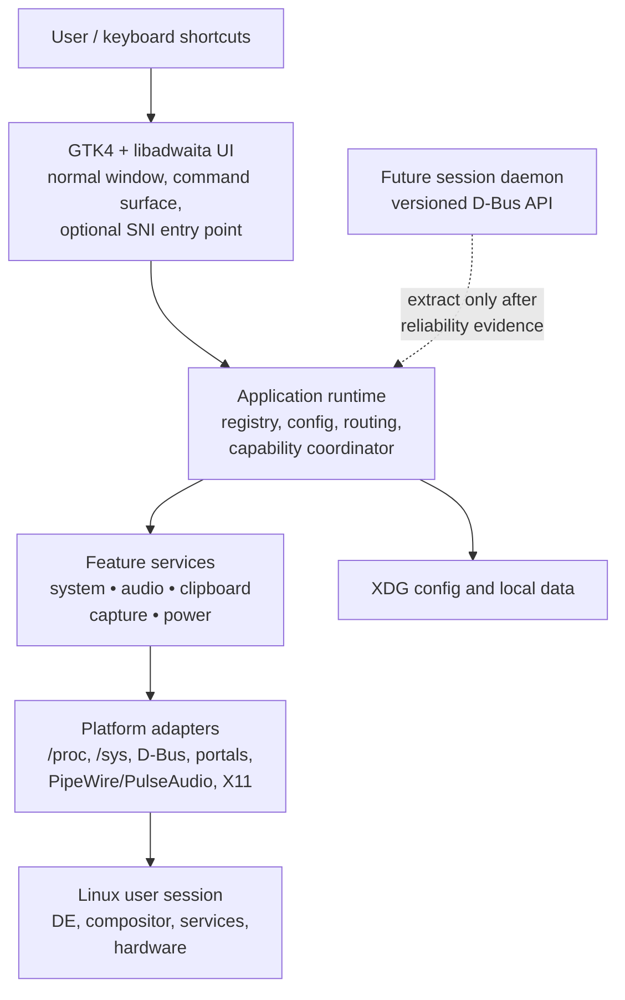
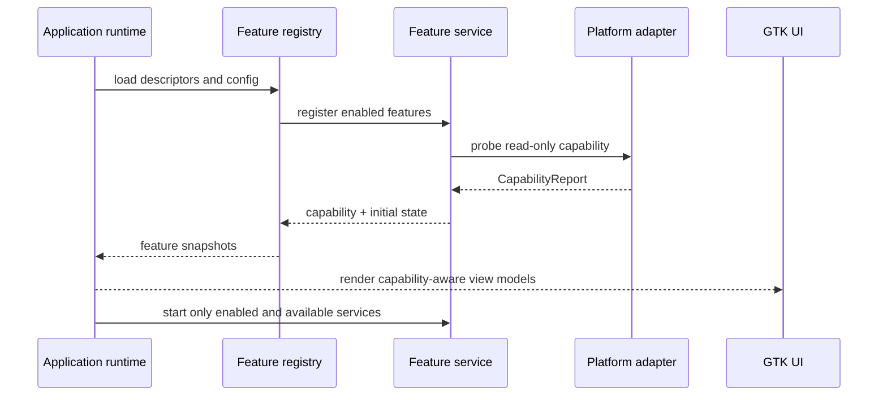
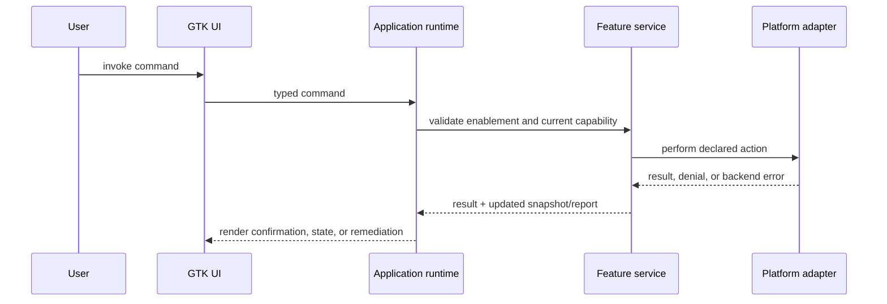

# Kestrel Initial Architecture

Status: **Initial design — implementation guide**
Date: 2026-08-24

## 1. Purpose

This document turns the product requirements into an implementable initial
architecture. It defines stable boundaries and contracts for the Kestrel MVP; it
does not select unvalidated Phase 0 dependencies or promise feature support that
has not been tested on a target desktop.

Kestrel is a local-first, human-facing utility host. It works alongside an
existing Linux desktop rather than replacing its shell, panel, launcher,
notification daemon, or compositor configuration.

The architecture must make a feature's actual availability visible. A feature
may be enabled in configuration while being limited by a missing portal,
dependency, permission, device, package mode, or compositor interface.

## 2. Goals and non-goals

### Goals

- Run as an unprivileged process in the user's graphical session.
- Keep product and service logic independent of GTK widgets and display-server
  details.
- Probe concrete session capabilities instead of inferring support from a
  desktop name or `XDG_SESSION_TYPE` alone.
- Let each feature own its state, lifecycle, privacy policy, and platform
  adapters.
- Preserve a future path to separate the persistent session services from the
  UI through a versioned D-Bus API.
- Keep the initial core small enough to validate tray, monitoring, audio,
  clipboard, capture, and shortcut assumptions in Phase 0.

### Non-goals

- A root daemon, setuid binary, or unrestricted system-wide service.
- A replacement desktop shell or a requirement to take over a panel, dock,
  notification service, or compositor configuration.
- A universal window-management, input-injection, or hardware-control API.
- Building a full specialist replacement for every capture, audio, clipboard,
  or monitoring tool before validating Kestrel's cross-module workflows.
- A public, agent-oriented remote-control API in the MVP.

## 3. Deployment model

The MVP is one user-session process. It keeps four internal layers separate so
that the UI can later move into a different process without rewriting feature
logic.



### 3.1 Initial process rules

- The application owns the single-instance lock through a well-known session
  D-Bus name. A second launch requests an action from the running process.
- The process must remain useful without a tray host. A normal application
  window and command surface are always valid entry points.
- A background lifetime is opt-in and only justified by enabled services such
  as clipboard history. When no persistent feature is enabled, Kestrel may
  exit normally.
- Blocking system work runs outside the GTK main context. GTK receives
  immutable view state and dispatches typed commands only.
- Privileged operations are delegated to portals, existing user-session
  services, Polkit-mediated helpers, or are reported as unavailable.

### 3.2 Future extraction seam

The first process boundary is between the UI/application client and a
`kestrel-session` service. The internal service API must therefore avoid direct
GTK ownership, raw pointers, or process-local callback types. Extraction is
allowed only after Phase 0 or MVP evidence shows a concrete need, such as:

- persistent clipboard ownership surviving UI restarts;
- crash isolation between a UI and a long-running service;
- headless command execution;
- multiple UI surfaces sharing the same session state.

The service boundary uses a versioned D-Bus API with structured capability,
state, command, and error payloads. It is not introduced preemptively.

## 4. Workspace boundaries

The current workspace remains intentionally small. New crates are introduced
only after the Phase 0 spikes prove the APIs and dependency costs they need.

```text
apps/
  kestrel/                  GTK/libadwaita composition root and process startup
crates/
  kestrel-core/             Stable domain contracts; no GTK, D-Bus, or OS I/O
  kestrel-platform/         Future: platform probes and narrow OS adapters
  kestrel-services/         Future: feature lifecycle and state orchestration
  kestrel-session/          Future: optional D-Bus service process
```

### 4.1 `kestrel-core`

`kestrel-core` owns only portable, UI-agnostic contracts:

- feature identifiers, labels, categories, and enablement policy;
- capability status, remediation, and evidence;
- command, result, state-snapshot, and event schemas;
- domain error categories;
- configuration schema versions and migrations that do not require I/O.

It must not depend on GTK, libadwaita, `zbus`, PipeWire, X11, Wayland, shell
commands, or a specific async runtime.

### 4.2 `kestrel-platform`

This future crate owns adapters that communicate with the session and OS:

- `/proc`, `/sys`, UPower, NetworkManager, BlueZ, and systemd user-session
  services;
- PipeWire/PulseAudio discovery and control;
- XDG portal and D-Bus capability inspection;
- X11 or compositor-specific capability adapters;
- optional executable discovery.

It exposes domain-shaped values to services. It does not define product policy
or construct GTK widgets.

### 4.3 `kestrel-services`

This future crate owns feature orchestration. A service combines one or more
platform adapters, produces immutable state snapshots, applies feature-specific
privacy policy, and handles typed commands. It does not import GTK types or
decide which UI surface presents a state.

### 4.4 `apps/kestrel`

The application crate is the composition root:

- initializes logging, configuration I/O, the registry, and platform adapters;
- owns GTK/libadwaita lifecycle and translates core snapshots into view models;
- hosts the normal settings and capability surfaces;
- optionally hosts an SNI integration when the target session provides one;
- translates user interactions into core commands and renders results.

## 5. Core domain contracts

### 5.1 Identifiers and registry

Every feature has a stable, namespaced identifier such as `audio.mixer`,
`clipboard.history`, or `capture.screenshot`. IDs are persisted in
configuration, referenced by diagnostics, and never derived from localized
labels.

The registry is the source of truth for known features and their configuration
policy. It separates:

1. **Registered** — Kestrel knows the feature.
2. **Enabled** — the user has opted into the feature.
3. **Available** — the current session can execute it.
4. **Running** — its service is currently active.

An enabled feature can be unavailable or stopped; availability must not be
represented as a boolean enablement flag.

### 5.2 Capability report

The existing `CapabilityStatus` enum remains the high-level summary. Each
runtime probe expands it into a structured report:

```text
CapabilityReport
  feature_id
  status
  summary
  selected_backend
  alternatives_considered
  remediation
  evidence
  observed_at
```

- `selected_backend` identifies the path actually selected, such as a portal,
  D-Bus service, PipeWire compatibility API, or X11 adapter.
- `alternatives_considered` records viable fallbacks for diagnostics, without
  exposing implementation detail as product policy.
- `remediation` is a user-facing action or explanation, not a generic error
  string.
- `evidence` records non-sensitive facts such as an interface version,
  dependency presence, permission denial, or unavailable protocol.
- `observed_at` allows the runtime to invalidate stale hardware or service
  probes.

Probes are read-only. They must never trigger a portal consent dialog, request
input privileges, modify system configuration, or launch a helper merely to
decide availability.

### 5.3 Commands and results

Feature actions are typed requests with declared side-effect and permission
requirements. Examples include `SetStreamVolume`, `CopyHistoryItem`,
`BeginScreenCapture`, and `SetKeepAwake`.

Each command produces one of:

- a successful value or updated snapshot;
- a structured domain error;
- a refreshed capability report when the action cannot proceed.

Commands that can prompt, alter data, or invoke privileged services declare
that fact before the UI presents confirmation. Platform adapters do not silently
fall back from a denied safe path to a broader-privilege path.

### 5.4 State snapshots and events

Services own mutable internal state but publish immutable snapshots. Snapshot
publication is coalesced for high-frequency sources such as monitoring, while
commands receive ordered handling per feature.

Events have three scopes:

- **StateChanged** — a service publishes a new immutable snapshot.
- **CapabilityChanged** — a probe result changed because a device, portal,
  dependency, or session service changed.
- **AttentionRequired** — user action is needed, such as a portal grant,
  expired consent, missing runtime package, or privacy limit.

The application runtime routes events through an internal event interface. The
implementation may use async channels, but channel types do not escape
`kestrel-services` or `apps/kestrel`.

## 6. Feature-service lifecycle

Each service follows the same lifecycle:

```text
register → probe → configure → start → publish → refresh/handle commands → stop
```

1. **Register:** the registry loads the feature descriptor and persisted
   enablement policy.
2. **Probe:** adapters produce a non-interactive `CapabilityReport`.
3. **Configure:** service-specific configuration is validated and migrated.
4. **Start:** enabled and available services acquire only their declared
   resources.
5. **Publish:** the service emits an initial snapshot followed by state changes.
6. **Refresh/handle commands:** commands are serialized where state ordering
   matters; capability refreshes occur on explicit signals or bounded polling.
7. **Stop:** resources, portal sessions, clipboard ownership, subscriptions,
   and tasks are released deterministically.

Feature crashes or unavailable adapters must resolve to a feature-level error
state and diagnostic event, not terminate the application.

## 7. Platform-adapter rules

### 7.1 Adapter selection

Services request a capability, not a session type. The platform layer uses a
feature-specific ordered policy:

1. Prefer a standard portal or documented D-Bus API that matches the action.
2. Use a supported native user-session API where portals are insufficient.
3. Use a well-defined executable integration only when its availability and
   behavior can be diagnosed.
4. Return an explicit limited or unsupported state when no safe, verified path
   exists.

Kestrel never interprets the presence of Wayland, X11, GNOME, KDE, or a
compositor name as proof that a specific capability exists.

### 7.2 Probe and mutation separation

Each adapter has distinct read-only probe and action interfaces. For example,
screen capture probing checks for a compatible portal interface and backend;
starting a capture is the separate, user-initiated operation that may open
consent UI.

This separation prevents startup surprise prompts and lets the capability
center explain the exact precondition for every action.

### 7.3 Unsupported backend

Every adapter family supplies an explicit unsupported implementation. It
returns a structured status with a reason and remediation rather than
conditionally compiling a null path or silently doing nothing.

## 8. Runtime flows

### 8.1 Startup and capability discovery



Startup completes even if every optional integration is unavailable. The user
can always open the capability center and inspect the reason.

### 8.2 User command execution



A permission denial or missing dependency is a normal result path. The UI must
show remediation and preserve the previous state rather than reporting an
unstructured failure.

### 8.3 Capability refresh

Refreshes occur through bounded polling or subscribed signals, depending on
the adapter:

- UPower, NetworkManager, BlueZ, PipeWire, and portal services should prefer
  D-Bus or native event signals where available.
- `/proc`, `/sys`, and hardware state use bounded, configurable polling.
- Portal or compositor service appearance may trigger a reprobe.
- A feature can request an explicit user-initiated reprobe from the capability
  center.

Capability reports are cached for the session and invalidated on relevant
events. Reprobing must remain non-interactive.

## 9. Configuration, data, and privacy

### 9.1 Configuration

Kestrel stores versioned configuration under `$XDG_CONFIG_HOME/kestrel/`.
Configuration distinguishes:

- global UI and startup preferences;
- feature enablement;
- non-sensitive feature options;
- schema version and migration history.

Secrets, tokens, and credentials are not stored in the main configuration file.
If a future provider requires a secret, it must use an OS secret service or an
explicitly documented secure storage integration.

### 9.2 Local data

Persistent data belongs under the relevant XDG data and state directories.
Features define retention, maximum item size, and clear behavior before
persisting sensitive content.

Clipboard history is disabled by default until a user enables it. Its service
must support item-size limits, retention bounds, immediate wipe, and
per-application exclusions before it is considered an MVP-complete feature.

Capture, OCR, and recording workflows remain local by default. Any future
upload provider is a separately enabled feature with a visible destination and
retention policy.

### 9.3 Diagnostics

Diagnostics use the same capability evidence that powers the UI. An exportable
report must omit clipboard content, authentication material, session addresses,
unnecessary file paths, and network identifiers. The diagnostic schema is
versioned so support reports remain interpretable across releases.

## 10. Security and failure boundaries

- No feature may require root merely for installation, startup, or monitoring.
- Input injection, hardware control, capture, and recording are isolated
  feature capabilities with explicit setup and consent requirements.
- Broad group membership is not an automatic fallback for a denied portal or
  unavailable standard interface.
- Feature configuration is validated before use; malformed configuration
  disables only the affected feature and creates a diagnostic event.
- External executable integrations use absolute or resolved executable paths,
  timeouts, bounded output, and structured error conversion.
- D-Bus, portal, and compositor identifiers are treated as untrusted runtime
  input and validated before they influence commands or persistence.

## 11. Phase 0 implementation boundary

Phase 0 validates architecture assumptions through small, disposable probes:

| Spike | Architecture evidence produced | Production commitment after success |
|---|---|---|
| Tray/SNI | Access paths and GNOME fallback behavior | Optional UI adapter only; never sole entry point |
| System monitor | Sensor identity, sampling cost, missing-hardware states | `system-monitor` service and `/proc`/`/sys` adapter |
| Audio | Stream discovery, volume mutation, PipeWire/PulseAudio behavior | `audio` service and selected audio adapter |
| Clipboard | Ownership persistence, privacy controls, X11/Wayland behavior | `clipboard` lifecycle and storage contract |
| Screenshot | Portal discovery, consent, cancellation, artifact handling | `capture` service and portal adapter |
| Global shortcut | Portal, compositor, or X11 fallback behavior | Command-surface activation policy |
| Internal D-Bus | UI/service boundary viability | Decision on when to extract `kestrel-session` |

Until a spike succeeds, its future crate remains a documented boundary rather
than a workspace member. This prevents speculative dependencies and abstractions
from hardening before Kestrel has verified them on release-target desktops.

## 12. Architecture acceptance criteria

Before entering Phase 1, Kestrel must have evidence that:

1. `kestrel-core` remains independent of UI and OS integration libraries.
2. At least two target desktops can produce structured capability reports for
   every proposed MVP feature.
3. Unsupported, missing-dependency, and permission-gated paths have specific
   remediation and do not crash the process.
4. Clipboard, capture, audio, and input resources have deterministic cleanup.
5. The normal window/command entry point works even without a tray host.
6. The selected native package and AppImage modes preserve the same capability
   reporting semantics.

See `docs/REQUIREMENTS.md` for the support contract, security model, feature
scope, and release roadmap this design implements.
