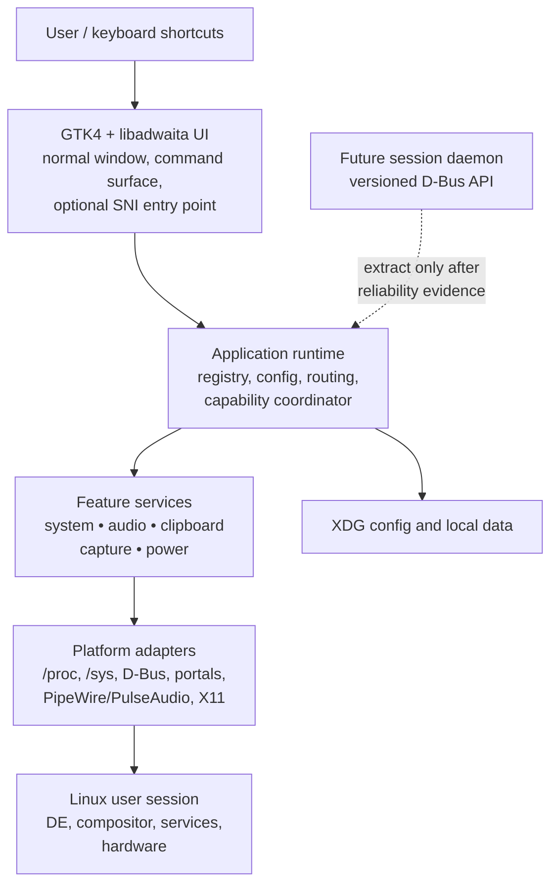
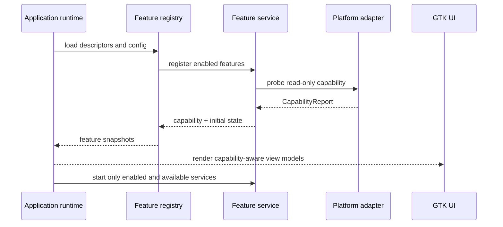
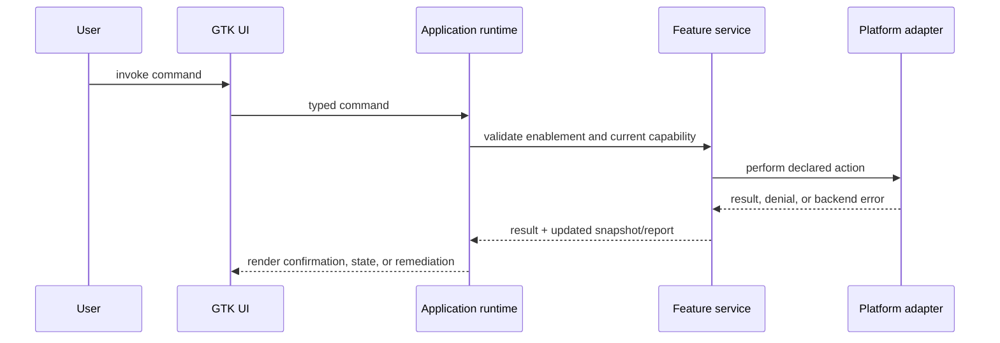

# Kestrel Initial Architecture

Status: **Initial design — implementation guide**
Date: 2026-08-24

## 1. Purpose

This document turns the product requirements into an implementable initial
architecture. It defines stable boundaries and contracts for the Kestrel MVP; it
does not select unvalidated Phase 0 dependencies or promise feature support that
has not been tested on a target desktop.

Kestrel is a local-first, human-facing utility host. It works alongside an
existing Linux desktop rather than replacing its shell, panel, launcher,
notification daemon, or compositor configuration.

The architecture must make a feature's actual availability visible. A feature
may be enabled in configuration while being limited by a missing portal,
dependency, permission, device, package mode, or compositor interface.

## 2. Goals and non-goals

### Goals

- Run as an unprivileged process in the user's graphical session.
- Keep product and service logic independent of GTK widgets and display-server
  details.
- Probe concrete session capabilities instead of inferring support from a
  desktop name or `XDG_SESSION_TYPE` alone.
- Let each feature own its state, lifecycle, privacy policy, and platform
  adapters.
- Preserve a future path to separate the persistent session services from the
  UI through a versioned D-Bus API.
- Keep the initial core small enough to validate tray, monitoring, audio,
  clipboard, capture, and shortcut assumptions in Phase 0.

### Non-goals

- A root daemon, setuid binary, or unrestricted system-wide service.
- A replacement desktop shell or a requirement to take over a panel, dock,
  notification service, or compositor configuration.
- A universal window-management, input-injection, or hardware-control API.
- Building a full specialist replacement for every capture, audio, clipboard,
  or monitoring tool before validating Kestrel's cross-module workflows.
- A public, agent-oriented remote-control API in the MVP.

## 3. Deployment model

The MVP is one user-session process. It keeps four internal layers separate so
that the UI can later move into a different process without rewriting feature
logic.


```mermaid
flowchart TB
  User["User / keyboard shortcuts"] --> UI["GTK4 + libadwaita UI\nnormal window, command surface,\noptional SNI entry point"]
  UI --> App["Application runtime\nregistry, config, routing,\ncapability coordinator"]
  App --> Features["Feature services\nsystem • audio • clipboard\ncapture • power"]
  Features --> Adapters["Platform adapters\n/proc, /sys, D-Bus, portals,\nPipeWire/PulseAudio, X11"]
  Adapters --> Session["Linux user session\nDE, compositor, services,\nhardware"]
  App --> Store["XDG config and local data"]
  Future["Future session daemon\nversioned D-Bus API"] -. "extract only after\nreliability evidence" .-> App
```

### 3.1 Initial process rules

- The application owns the single-instance lock through a well-known session
  D-Bus name. A second launch requests an action from the running process.
- The process must remain useful without a tray host. A normal application
  window and command surface are always valid entry points.
- A background lifetime is opt-in and only justified by enabled services such
  as clipboard history. When no persistent feature is enabled, Kestrel may
  exit normally.
- Blocking system work runs outside the GTK main context. GTK receives
  immutable view state and dispatches typed commands only.
- Privileged operations are delegated to portals, existing user-session
  services, Polkit-mediated helpers, or are reported as unavailable.

### 3.2 Future extraction seam

The first process boundary is between the UI/application client and a
`kestrel-session` service. The internal service API must therefore avoid direct
GTK ownership, raw pointers, or process-local callback types. Extraction is
allowed only after Phase 0 or MVP evidence shows a concrete need, such as:

- persistent clipboard ownership surviving UI restarts;
- crash isolation between a UI and a long-running service;
- headless command execution;
- multiple UI surfaces sharing the same session state.

The service boundary uses a versioned D-Bus API with structured capability,
state, command, and error payloads. It is not introduced preemptively.

## 4. Workspace boundaries

The current workspace remains intentionally small. New crates are introduced
only after the Phase 0 spikes prove the APIs and dependency costs they need.

```text
apps/
  kestrel/                  GTK/libadwaita composition root and process startup
crates/
  kestrel-core/             Stable domain contracts; no GTK, D-Bus, or OS I/O
  kestrel-platform/         Future: platform probes and narrow OS adapters
  kestrel-services/         Future: feature lifecycle and state orchestration
  kestrel-session/          Future: optional D-Bus service process
```

### 4.1 `kestrel-core`

`kestrel-core` owns only portable, UI-agnostic contracts:

- feature identifiers, labels, categories, and enablement policy;
- capability status, remediation, and evidence;
- command, result, state-snapshot, and event schemas;
- domain error categories;
- configuration schema versions and migrations that do not require I/O.

It must not depend on GTK, libadwaita, `zbus`, PipeWire, X11, Wayland, shell
commands, or a specific async runtime.

### 4.2 `kestrel-platform`

This future crate owns adapters that communicate with the session and OS:

- `/proc`, `/sys`, UPower, NetworkManager, BlueZ, and systemd user-session
  services;
- PipeWire/PulseAudio discovery and control;
- XDG portal and D-Bus capability inspection;
- X11 or compositor-specific capability adapters;
- optional executable discovery.

It exposes domain-shaped values to services. It does not define product policy
or construct GTK widgets.

### 4.3 `kestrel-services`

This future crate owns feature orchestration. A service combines one or more
platform adapters, produces immutable state snapshots, applies feature-specific
privacy policy, and handles typed commands. It does not import GTK types or
decide which UI surface presents a state.

### 4.4 `apps/kestrel`

The application crate is the composition root:

- initializes logging, configuration I/O, the registry, and platform adapters;
- owns GTK/libadwaita lifecycle and translates core snapshots into view models;
- hosts the normal settings and capability surfaces;
- optionally hosts an SNI integration when the target session provides one;
- translates user interactions into core commands and renders results.

## 5. Core domain contracts

### 5.1 Identifiers and registry

Every feature has a stable, namespaced identifier such as `audio.mixer`,
`clipboard.history`, or `capture.screenshot`. IDs are persisted in
configuration, referenced by diagnostics, and never derived from localized
labels.

The registry is the source of truth for known features and their configuration
policy. It separates:

1. **Registered** — Kestrel knows the feature.
2. **Enabled** — the user has opted into the feature.
3. **Available** — the current session can execute it.
4. **Running** — its service is currently active.

An enabled feature can be unavailable or stopped; availability must not be
represented as a boolean enablement flag.

### 5.2 Capability report

The existing `CapabilityStatus` enum remains the high-level summary. Each
runtime probe expands it into a structured report:

```text
CapabilityReport
  feature_id
  status
  summary
  selected_backend
  alternatives_considered
  remediation
  evidence
  observed_at
```

- `selected_backend` identifies the path actually selected, such as a portal,
  D-Bus service, PipeWire compatibility API, or X11 adapter.
- `alternatives_considered` records viable fallbacks for diagnostics, without
  exposing implementation detail as product policy.
- `remediation` is a user-facing action or explanation, not a generic error
  string.
- `evidence` records non-sensitive facts such as an interface version,
  dependency presence, permission denial, or unavailable protocol.
- `observed_at` allows the runtime to invalidate stale hardware or service
  probes.

Probes are read-only. They must never trigger a portal consent dialog, request
input privileges, modify system configuration, or launch a helper merely to
decide availability.

### 5.3 Commands and results

Feature actions are typed requests with declared side-effect and permission
requirements. Examples include `SetStreamVolume`, `CopyHistoryItem`,
`BeginScreenCapture`, and `SetKeepAwake`.

Each command produces one of:

- a successful value or updated snapshot;
- a structured domain error;
- a refreshed capability report when the action cannot proceed.

Commands that can prompt, alter data, or invoke privileged services declare
that fact before the UI presents confirmation. Platform adapters do not silently
fall back from a denied safe path to a broader-privilege path.

### 5.4 State snapshots and events

Services own mutable internal state but publish immutable snapshots. Snapshot
publication is coalesced for high-frequency sources such as monitoring, while
commands receive ordered handling per feature.

Events have three scopes:

- **StateChanged** — a service publishes a new immutable snapshot.
- **CapabilityChanged** — a probe result changed because a device, portal,
  dependency, or session service changed.
- **AttentionRequired** — user action is needed, such as a portal grant,
  expired consent, missing runtime package, or privacy limit.

The application runtime routes events through an internal event interface. The
implementation may use async channels, but channel types do not escape
`kestrel-services` or `apps/kestrel`.

### 5.5 Monitoring sampling and alert policy

`system.monitor` is a caller-driven service. The application schedules bounded
ticks, and each tick asks the service for at most one sample; a tick that
arrives before the configured interval has elapsed is skipped rather than
queued, so sampling coalesces instead of accumulating work. Samples on the
application side run on a named worker thread; the GTK main context only
receives owned presentation state and never performs platform reads or
notification delivery.

The service retains the latest immutable `SystemSnapshot` plus a bounded ring
of compact `HistorySample` values. The ring capacity is configuration, is
capped by a core constant, and drops the oldest entry first; history is
memory-only and is never written to disk. Unreadable metric families stay in
the snapshot as explicit source issues, and the fixed issue order keeps issue
lists stable for presentation.

Alerts are pure policy in `kestrel-services`: an `AlertEngine` consumes an
immutable snapshot and returns owned `AlertEvent` values. Rules are evaluated
per kind and are independent — an unobservable or disabled kind never changes
another kind's sustain counter, active state, or cooldown clock. A rule raises
only after the threshold is crossed for the configured number of consecutive
samples, re-arms only after the value recovers past a hysteresis margin, and
repeats no faster than its cooldown. Delivering a notification is an
application-layer side effect; delivery failures are recorded per kind and
surfaced in the window instead of stopping evaluation.

Per-process metrics are deliberately not collected. The monitor reports them as
an unavailable capability rather than probing process identity or command
lines, so snapshots, history, and diagnostics carry only system-level,
non-identifying measurements.

### 5.6 Audio mixer policy and device-loss handling

`audio.mixer` follows the same layering as monitoring. `kestrel-core` owns the
portable bounds: the unamplified volume, the hard amplification cap, the default
boost ceiling, and the `[audio]` configuration contract. `kestrel-services`
owns mixer policy — the effective boost ceiling, whether a default-output switch
also moves playing streams, what happens to a stream whose output device
disappears, and whether inactive streams are listed. The `kestrel-platform`
adapter owns the PulseAudio-compatible protocol through `libpulse`; no
production path parses `pactl` or `wpctl` output.

Amplification is bounded and explicit. A request above the effective ceiling is
rejected with that maximum instead of being clamped, and the adapter checks the
hard cap again before touching the server. Server values above the ceiling stay
readable, and percentage conversion rounds to nearest so a set/read round trip
is exact at every step.

The service retains the unfiltered discovery for validation and reconciliation,
while presentation state carries the filter result plus the hidden-stream count,
so a corked stream that is not listed stays addressable by identifier. Each
refresh compares the previous outputs with the current graph; streams whose
output vanished are re-homed to the default output and, under the reset policy,
have their volume reapplied before the graph is re-read. The outcome is recorded
as owned diagnostics (`last_reconcile`, `last_switch`) and surfaced in the
window, so device loss produces a reported repair rather than stale routing or a
feature failure.

`audio.microphone` is a separate feature on the same adapter, so microphone
policy never widens the mixer's responsibilities. The platform layer exposes a
`MicrophoneBackend` over capture sources (sink monitors excluded); the service
derives the mute state from the inputs the server reports — `Muted`, `Live`,
`Mixed`, `NoInputs`, or `Unknown` when nothing trustworthy was read. Commands
re-read the server before validating and after mutating, global mute applies to
every input, and a partial failure is reported while the snapshot shows the
real result. A failed read or a stopped feature resets the snapshot to
`Unknown`, and a vanished default input clears the default claim, so no stale
mute or preferred-device state can be presented. The running control is polled
on a bounded two-second cadence because PulseAudio subscriptions would require a
long-lived connection the mixer does not hold yet. Evidence carries counts only.

### 5.7 Clipboard retention, ownership, and queries

`clipboard.history` is an opt-in, memory-only service. Retained content lives in
the worker inside zeroizing buffers; the published `ClipboardSnapshot` carries
metadata only (identifier, kind, byte size, age, pin, and non-sensitive
descriptors such as PNG dimensions or path count). Content leaves the worker
through exactly two paths: an explicit bounded search that returns previews for
matching entries, and an explicit bounded preview for one entry. Neither path
touches the snapshot, a capability report, or a diagnostic.

Entry kinds are per capability, not per platform claim. The Wayland adapter
carries text, PNG images, and `text/uri-list` file lists; the X11 compatibility
path is text-only and says so in its capability evidence and remediation.
Rich payloads are transferred byte-exact — an image entry is the original PNG
and a file entry is the URI list — so Kestrel never decodes, re-encodes, or
re-renders retained content, and per-kind bounds (item bytes, image bytes, file
count, total bytes, age) are enforced independently when an entry is captured.

Ownership uses one mechanism per selection: Kestrel serves what it owns over
Wayland data-control (text under the common plain-text MIME types, PNG under
`image/png`, file lists under `text/uri-list`) and releases it by tearing that
source down. Text reads still use arboard, and the X11 path keeps arboard's
ownership. A release only ever removes Kestrel's own source: if another source
still exposes those bytes, that is not Kestrel's selection to clear, and the
next poll captures the re-published content again so the state stays visible
rather than silently diverging.

Session privacy is unchanged from the retention contract: lock, sleep, service
stop, shutdown, and wipe drop every retained entry (pinned entries included) and
release the owned selection. The independent automatic clear only releases the
live selection after a configured interval and never touches saved entries.

The window learns about clipboard changes through the same periodic tick as
monitoring: the tick compares a metadata fingerprint (lifecycle, counts, byte
total, pin/filter/clear/wipe counters, error presence) and, when it differs,
re-runs the current query and hands the window owned presentation state. A
background capture, an automatic selection clear, and a lock-time wipe therefore
all become visible without a user action, and the search field keeps its text
and focus because only the result rows are rebuilt.

### 5.8 Snippet storage, rendering, and insertion

Snippets are the first feature with user-authored persistent content, so the
layering is explicit. `kestrel-core` owns the portable definition, the variable
vocabulary, and the bounds; `kestrel-services` owns the library (name and
trigger uniqueness, delimiter-shaped triggers, folders, search) and rendering;
`kestrel-platform` owns the insertion adapters and the session clock; the
application layer owns the file.

The file lives in the XDG data directory, is created `0600` inside a `0700`
directory, and is replaced atomically through a temporary file plus rename, so a
partial or world-readable library cannot appear. Only literal `{{...}}` tokens
are stored, which is what keeps resolved values — and therefore any
clipboard-derived text — out of the persisted state and out of the portable
configuration export.

Rendering is pure: given a clock reading and an optional clipboard value it
returns the same output every time, so previews use placeholders and never read
the clock or the selection, while an actual insertion substitutes real values and
clips the clipboard variable to its bound. An unknown token fails validation at
the library boundary rather than being expanded at insert time.

Insertion is capability-gated rather than assumed. Discovery resolves an
executable on `PATH` without a shell and accepts `wtype` and `xdotool`
automatically; the uinput-based provider is excluded from automatic selection
because it needs input-device access a user must grant deliberately, and it is
only used when the configuration names it. With no verified provider the
capability report carries the missing dependency and its remediation and the
service refuses to insert, so the feature cannot type text through an
unvalidated mechanism. A provider run is bounded by a timeout, receives its
payload as one argument, and reports only a structured outcome.

Trigger expansion timing is stored as user intent and currently reported as
inactive: delimiter expansion requires a key-capture provider, which the current
feature set does not include, so only manual insertion inserts text.

### 5.9 Command ranking, providers, and bounded actions

The command bar is a ranking problem, not an index. `kestrel-services` holds the
catalog (Kestrel actions, quick toggles, snippets, configured scripts, and a
built-in emoji table), the fuzzy scorer, and the learned ranking; it receives the
already-gathered application and file results from the application layer, so the
service stays pure and testable and never performs I/O itself.

Ranking is bounded by construction. Scores prefer prefix, contiguous, and short
matches; pins and learned use counts break ties deterministically. The learned
state maps identifiers to counts plus a pin set, has no field able to hold query
text, is capped by a core constant with least-used eviction, and is persisted to
a `0600` file that the window can inspect and reset.

Providers are classified by what they need. Portable providers (Kestrel actions,
snippets, math, units, dates, links, emoji) answer without any desktop
integration, so a missing provider reduces coverage instead of hiding results.
Integration providers are capability-checked: XDG application directories are
scanned with a file budget, applications launch through GIO's desktop-entry
support (which applies `Terminal=true`, `TryExec`, and field codes), `xdg-open`
must resolve before links and files are opened, and file search runs only inside
user-configured roots with depth, entry, and match budgets that skip hidden and
symlinked directories. Nothing constructs a filesystem-wide index in any
configuration.

Every action that leaves the process goes through a bounded adapter: a resolved
executable, one argv vector, no shell, a timeout, and capped output read on
dedicated threads. Script outcomes carry the exit status, the duration, and
whether output hit its bound, so truncation is data the user can see rather than
a silent loss.

### 5.10 Network speed test

`network.speed_test` never runs on its own: enabling the feature makes a test
startable, and only an explicit start command spawns the named
`kestrel-speed-test` worker. `kestrel-core` owns the transfer bounds and the
`[speed_test]` contract; the provider (host and operator) is a typed platform
constant, and the window renders the disclosure built from it and the plan
before the Start control.

The platform adapter is a bounded executable adapter over the system `curl`:
resolved path, no shell, `--disable` so no curlrc applies, HTTPS only, no
redirects, a per-phase timeout, and its own process group so cancel and timeout
end every descendant. Kestrel counts the download stream itself and stops it at
the planned size, and writes exactly the planned upload payload, so the bound
does not depend on the server. curl's stderr is discarded because it can name
resolved addresses; exit codes map to typed failures with Kestrel-authored
messages. The service publishes progress through a generation counter so the
periodic tick only rebuilds the panel when something changed, and `stop()` —
called when the feature is disabled and on drop — cancels and joins the worker.

### 5.11 Command entry points and global shortcuts

`kestrel --command <id>` parses the ID locally (at most 64 characters of
`[a-z0-9._-]`; unknown and malformed IDs exit 2 before touching D-Bus) and
forwards it through `GApplication` command-line forwarding. The running
instance checks the action's feature registration and returns a typed
`CommandGate` as the exit status: 3 disabled, 4 unavailable, 5 stopped; the
window shows the full reason and the client prints it. Gated actions are never
queued. When no instance runs, the invocation becomes the instance and opens the
window. `command-bar.open` and `clipboard.quick-paste` present the window and
focus their search entry.

`global.shortcuts` is opt-in. `kestrel-core` owns the `[[shortcuts.bindings]]`
contract (command ID, canonical `ShortcutTrigger`, at most 32 bindings); the
app resolves each command through the `kestrel --command` vocabulary, so a
shortcut and a forwarded command run the same `ApplicationCommand`. Unknown
commands are skipped and listed in the panel.

The probe reads `XDG_SESSION_TYPE`, `WAYLAND_DISPLAY`, `DISPLAY`, and the
portal's `GlobalShortcuts` `version` property (two-second timeout) and opens
no session. Provider order is the portal, then `XGrabKey` on real X11 sessions;
Xwayland grabs do not see keys pressed in Wayland clients, so Wayland sessions
without the portal report unsupported with the `kestrel --command` remediation.

Both backends run on one named worker thread and publish a shared
`ShortcutStatus` (phase, per-binding state, generation counter):

- Portal: host `Registry.Register`, then `CreateSession` and `BindShortcuts`
  with predicted request paths subscribed before each call. The desktop may
  change or refuse triggers; the returned `trigger_description` is shown. A
  cancelled or denied dialog fails registration once, and the runtime does not
  retry until the feature is disabled and enabled again.
- X11: each trigger is grabbed with Lock/NumLock variants; a `BadAccess` reply
  marks that binding `Conflict` and releases its partial grabs while the others
  stay bound.

Activations become `ApplicationCommand`s on the GTK command channel.
`stop()` — on disable, on binding changes, and on drop — closes the portal
session or ungrabs every key, then joins the worker.

## 6. Feature-service lifecycle

Each service follows the same lifecycle:

```text
register → probe → configure → start → publish → refresh/handle commands → stop
```

1. **Register:** the registry loads the feature descriptor and persisted
   enablement policy.
2. **Probe:** adapters produce a non-interactive `CapabilityReport`.
3. **Configure:** service-specific configuration is validated and migrated.
4. **Start:** enabled and available services acquire only their declared
   resources.
5. **Publish:** the service emits an initial snapshot followed by state changes.
6. **Refresh/handle commands:** commands are serialized where state ordering
   matters; capability refreshes occur on explicit signals or bounded polling.
7. **Stop:** resources, portal sessions, clipboard ownership, subscriptions,
   and tasks are released deterministically.

Feature crashes or unavailable adapters must resolve to a feature-level error
state and diagnostic event, not terminate the application.

## 7. Platform-adapter rules

### 7.1 Adapter selection

Services request a capability, not a session type. The platform layer uses a
feature-specific ordered policy:

1. Prefer a standard portal or documented D-Bus API that matches the action.
2. Use a supported native user-session API where portals are insufficient.
3. Use a well-defined executable integration only when its availability and
   behavior can be diagnosed.
4. Return an explicit limited or unsupported state when no safe, verified path
   exists.

Kestrel never interprets the presence of Wayland, X11, GNOME, KDE, or a
compositor name as proof that a specific capability exists.

### 7.2 Probe and mutation separation

Each adapter has distinct read-only probe and action interfaces. For example,
screen capture probing checks for a compatible portal interface and backend;
starting a capture is the separate, user-initiated operation that may open
consent UI.

This separation prevents startup surprise prompts and lets the capability
center explain the exact precondition for every action.

### 7.3 Unsupported backend

Every adapter family supplies an explicit unsupported implementation. It
returns a structured status with a reason and remediation rather than
conditionally compiling a null path or silently doing nothing.

## 8. Runtime flows

### 8.1 Startup and capability discovery


```mermaid
sequenceDiagram
  participant App as Application runtime
  participant Registry as Feature registry
  participant Service as Feature service
  participant Adapter as Platform adapter
  participant UI as GTK UI

  App->>Registry: load descriptors and config
  Registry->>Service: register enabled features
  Service->>Adapter: probe read-only capability
  Adapter-->>Service: CapabilityReport
  Service-->>Registry: capability + initial state
  Registry-->>App: feature snapshots
  App-->>UI: render capability-aware view models
  App->>Service: start only enabled and available services
```

Startup completes even if every optional integration is unavailable. The user
can always open the capability center and inspect the reason.

### 8.2 User command execution


```mermaid
sequenceDiagram
  participant User
  participant UI as GTK UI
  participant App as Application runtime
  participant Service as Feature service
  participant Adapter as Platform adapter

  User->>UI: invoke command
  UI->>App: typed command
  App->>Service: validate enablement and current capability
  Service->>Adapter: perform declared action
  Adapter-->>Service: result, denial, or backend error
  Service-->>App: result + updated snapshot/report
  App-->>UI: render confirmation, state, or remediation
```

A permission denial or missing dependency is a normal result path. The UI must
show remediation and preserve the previous state rather than reporting an
unstructured failure.
Quick toggles follow the same command path but remain separate registry entries:
each namespaced toggle has its own probe, enablement gate, requirement text, and
snapshot. Destructive or disruptive adapters publish an exact scope and token;
the platform adapter recomputes that token immediately before mutation, so
stale Trash, removable-drive, session, or radio state cannot bypass
confirmation. Refresh compares provider observations with the last published
snapshot: commands mark state as Kestrel-owned, while later provider changes
are marked as external. The battery-alert service owns its bounded polling
thread and joins it on disable or shutdown; the platform layer only reads
battery state and sends notifications.


### 8.3 Capability refresh

Refreshes occur through bounded polling or subscribed signals, depending on
the adapter:

- UPower, NetworkManager, BlueZ, PipeWire, and portal services should prefer
  D-Bus or native event signals where available.
- `/proc`, `/sys`, and hardware state use bounded, configurable polling.
- Portal or compositor service appearance may trigger a reprobe.
- A feature can request an explicit user-initiated reprobe from the capability
  center.

Capability reports are cached for the session and invalidated on relevant
events. Reprobing must remain non-interactive.

## 9. Configuration, data, and privacy

### 9.1 Configuration

Kestrel stores versioned configuration under `$XDG_CONFIG_HOME/kestrel/`.
Configuration distinguishes:

- global UI and startup preferences;
- feature enablement;
- non-sensitive feature options;
- schema version and migration history.

Secrets, tokens, and credentials are not stored in the main configuration file.
If a future provider requires a secret, it must use an OS secret service or an
explicitly documented secure storage integration.

`kestrel-core` owns schema validation, complete feature-map snapshots, and
reversible preset data. `apps/kestrel` owns TOML and XDG file I/O, validates
imported feature and UI entries independently, and writes deterministic exports.
Portable configuration contains user intent only; it excludes service snapshots,
clipboard content, credentials, and resolved machine paths.

Appearance changes and XDG autostart desktop-file updates are application-layer
side effects. The controller persists their preference only after the side effect
succeeds and rolls back the presented configuration on failure. Presets similarly
snapshot the complete feature map before applying enablement policy, so undo
restores absent, disabled, and enabled entries exactly.

The `[monitoring]` table follows the same rules: it carries only user intent —
refresh interval, history capacity, readout selection and order, and one alert
rule per kind (enabled flag, threshold, sustained samples, cooldown). It never
stores observed values, device paths, mount points, or process data, so a
configuration file stays portable between machines. `kestrel-core` owns the
bounds, defaults, and validation for every field; `apps/kestrel` parses each
field independently and keeps the default for a field it cannot accept.

### 9.2 Local data

Persistent data belongs under the relevant XDG data and state directories.
Features define retention, maximum item size, and clear behavior before
persisting sensitive content.

Clipboard history is disabled by default until a user enables it. Its initial
service retains UTF-8 text only in zeroizing process memory with fixed item-size,
count, and age bounds. Immediate wipe, lock, sleep, shutdown, and service stop
clear retained buffers and release only a selection still owned by Kestrel.
Generic per-application exclusions are explicitly unavailable unless a future
desktop interface supplies verifiable source-application identity.

Capture, OCR, and recording workflows remain local by default. Any future
upload provider is a separately enabled feature with a visible destination and
retention policy.

### 9.3 Diagnostics

Diagnostics use the same capability evidence that powers the UI. An exportable
report must omit clipboard content, authentication material, session addresses,
unnecessary file paths, and network identifiers. The diagnostic schema is
versioned so support reports remain interpretable across releases.

Monitoring diagnostics follow the same rule: capability evidence names source
families and counts, never mount points, device nodes, or sampled values, and no
process, command-line, or per-process resource data is collected or exported at
all.

## 10. Security and failure boundaries

- No feature may require root merely for installation, startup, or monitoring.
- Input injection, hardware control, capture, and recording are isolated
  feature capabilities with explicit setup and consent requirements.
- Broad group membership is not an automatic fallback for a denied portal or
  unavailable standard interface.
- Feature configuration is validated before use; malformed configuration
  disables only the affected feature and creates a diagnostic event.
- External executable integrations use absolute or resolved executable paths,
  timeouts, bounded output, and structured error conversion.
- D-Bus, portal, and compositor identifiers are treated as untrusted runtime
  input and validated before they influence commands or persistence.

## 11. Phase 0 implementation boundary

Phase 0 validates architecture assumptions through small, disposable probes:

| Spike | Architecture evidence produced | Production commitment after success |
|---|---|---|
| Tray/SNI | Access paths and GNOME fallback behavior | Optional UI adapter only; never sole entry point |
| System monitor | Sensor identity, sampling cost, missing-hardware states | `system-monitor` service and `/proc`/`/sys` adapter |
| Audio | Stream discovery, volume mutation, PipeWire/PulseAudio behavior | `audio` service and selected audio adapter |
| Clipboard | Ownership persistence, privacy controls, X11/Wayland behavior | `clipboard` lifecycle and storage contract |
| Screenshot | Portal discovery, consent, cancellation, artifact handling | `capture` service and portal adapter |
| Global shortcut | Portal, compositor, or X11 fallback behavior | Command-surface activation policy |
| Internal D-Bus | UI/service boundary viability | Decision on when to extract `kestrel-session` |

Until a spike succeeds, its future crate remains a documented boundary rather
than a workspace member. This prevents speculative dependencies and abstractions
from hardening before Kestrel has verified them on release-target desktops.

## 12. Architecture acceptance criteria

Before entering Phase 1, Kestrel must have evidence that:

1. `kestrel-core` remains independent of UI and OS integration libraries.
2. At least two target desktops can produce structured capability reports for
   every proposed MVP feature.
3. Unsupported, missing-dependency, and permission-gated paths have specific
   remediation and do not crash the process.
4. Clipboard, capture, audio, and input resources have deterministic cleanup.
5. The normal window/command entry point works even without a tray host.
6. The selected native package and AppImage modes preserve the same capability
   reporting semantics.

See `docs/REQUIREMENTS.md` for the support contract, security model, feature
scope, and release roadmap this design implements.
